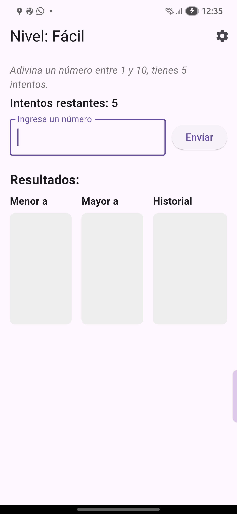
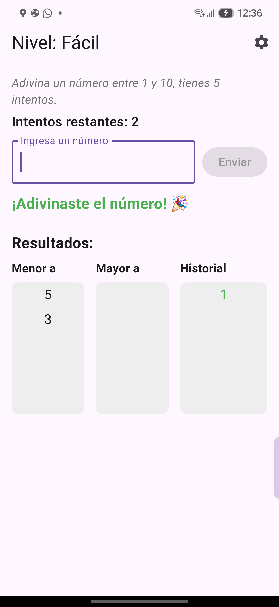
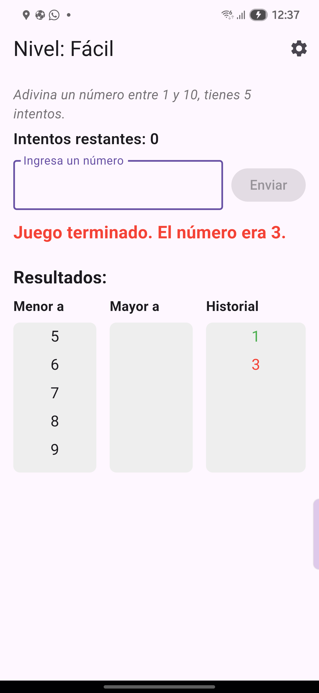
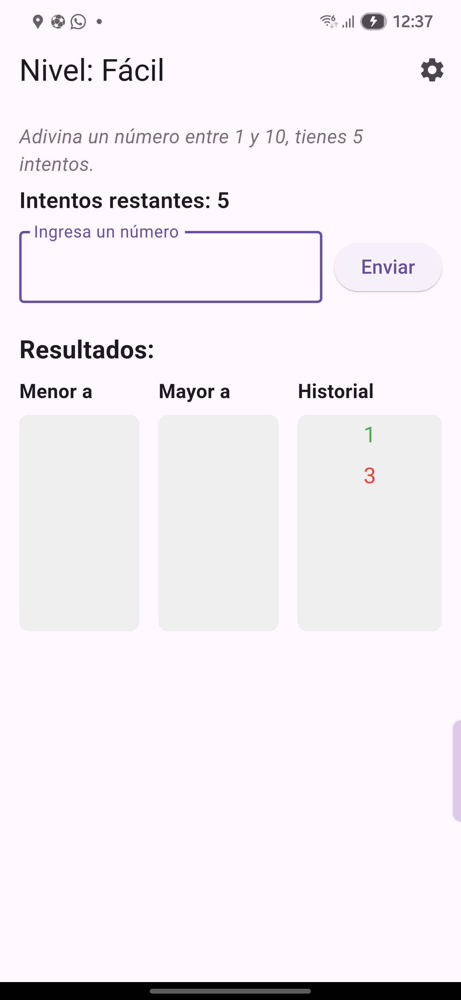
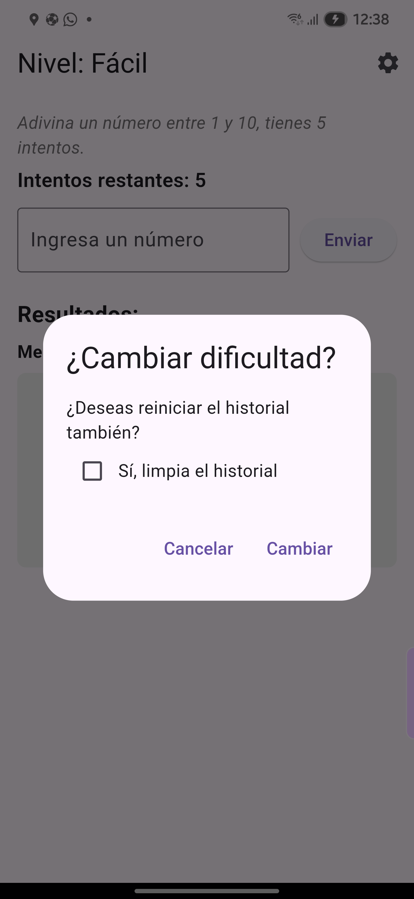
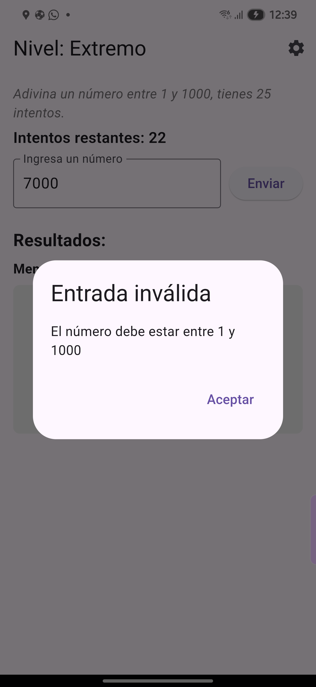
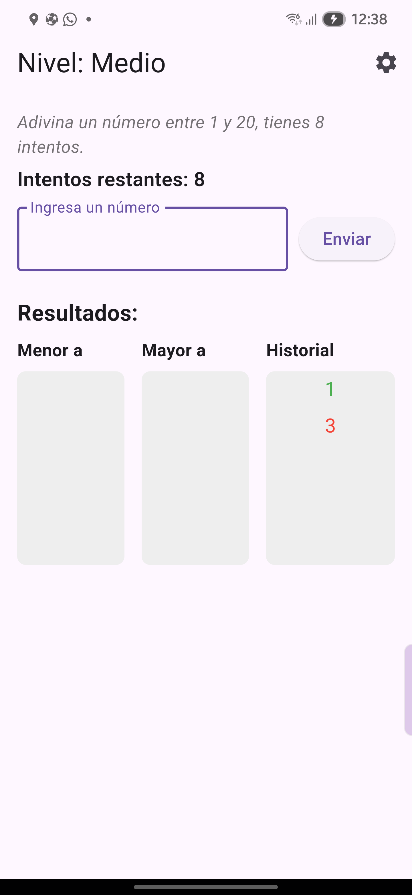
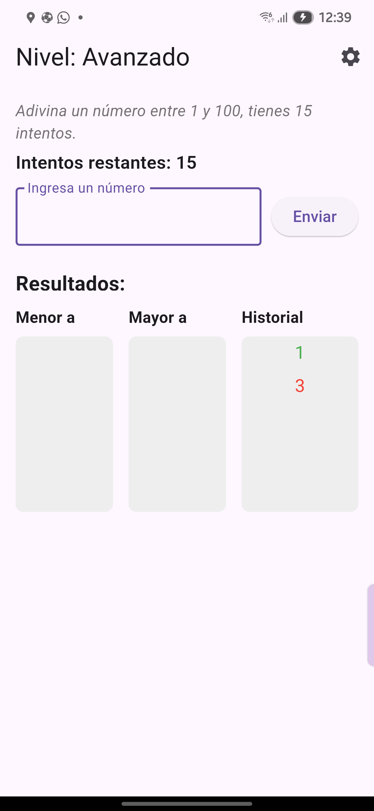
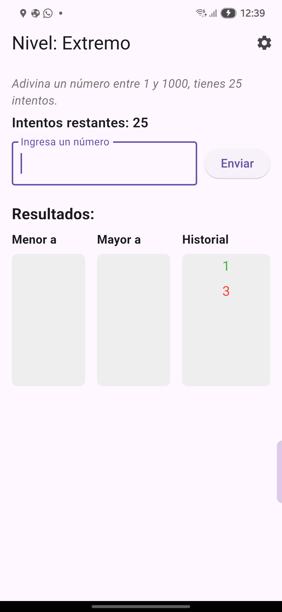
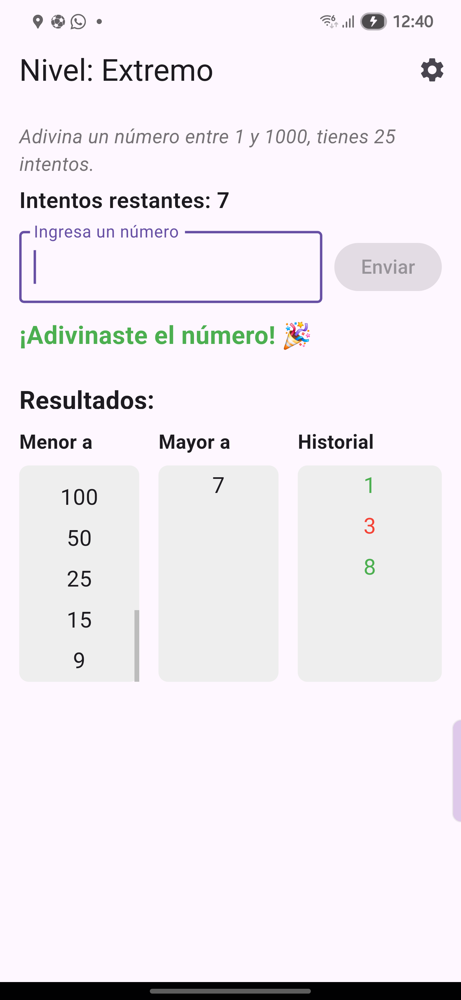

# 🎯 Número Secreto Flutter

Un juego interactivo desarrollado con Flutter, donde los usuarios deben adivinar un número secreto dentro de un rango determinado según el nivel de dificultad seleccionado.  
Incluye validación de entradas, historial visual de intentos y gestión dinámica de niveles.

---

## ✨ Características

- 🎚️ 4 niveles de dificultad: **Fácil**, **Medio**, **Avanzado** y **Extremo**
- 🔢 Validación de entradas numéricas dentro del rango permitido
- 🟢 Historial de juegos acertados y fallidos con indicadores de color
- 📜 Columnas con desplazamiento (scroll) para mostrar intentos mayores, menores e historial
- 🔄 Reinicio automático del juego tras 2 segundos al ganar o perder
- ⚙️ Opción para cambiar la dificultad y limpiar el historial

---


## 📸 Capturas de pantalla

| Inicio | Victoria | Derrota |
|-------|----------|---------|
|  |  |  |

| Reinicio | Cambiar dificultad | Entrada inválida |
|----------|---------------------|------------------|
|  |  |  |

### 📊 Diferentes niveles de dificultad

| Nivel Medio | Nivel Avanzado | Nivel Extremo |
|-------------|----------------|---------------|
|  |  |  |

### 🧾 Historial con scroll dinámico

<p align="center">
  
</p>


---

## Instalación y ejecución

1. Clona el repositorio:

```bash
git clone https://github.com/Ezdras01/numero_secreto_flutter.git
cd numero_secreto_flutter  # Entra a la carpeta del proyecto recién clonado

2. Instalar dependecias:
flutter pub get

3. Correr el proyecto:
futter run 

4. Generar APK
flutter build apk --release

## 📦 Descarga rápida

Puedes descargar directamente el APK aquí:

👉 [Descargar APK v1.0.0](https://github.com/Ezdras01/numero_secreto_flutter/releases/download/v1.0.0/app-release.apk)

> Si no puedes instalarlo directamente, asegúrate de permitir la instalación de aplicaciones desde fuentes externas en tu dispositivo Android.


## Autor

- Ezra Lehi Cortez — [@Ezdras01](https://github.com/Ezdras01)


