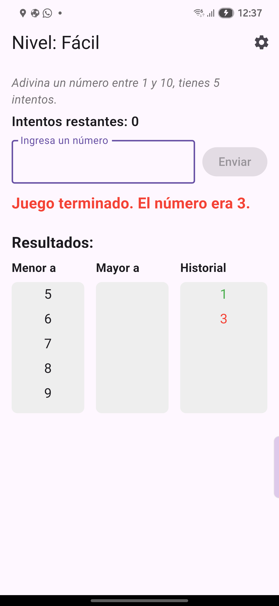
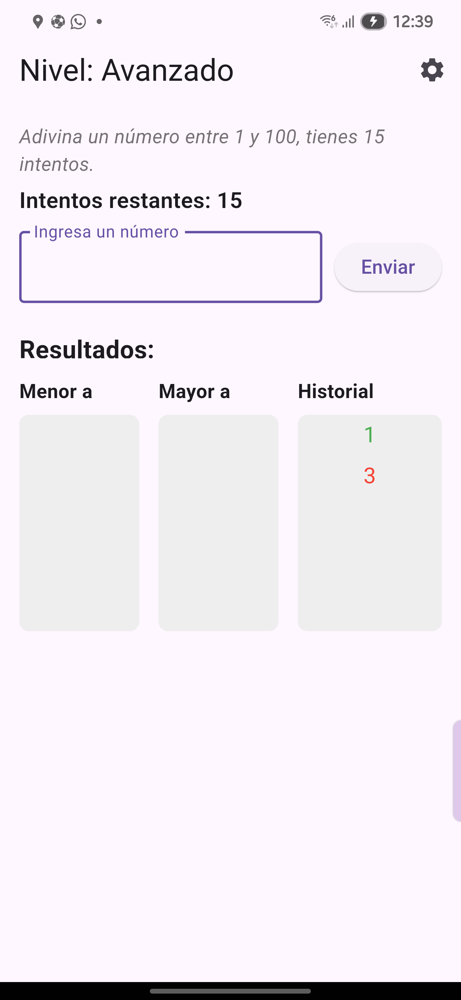
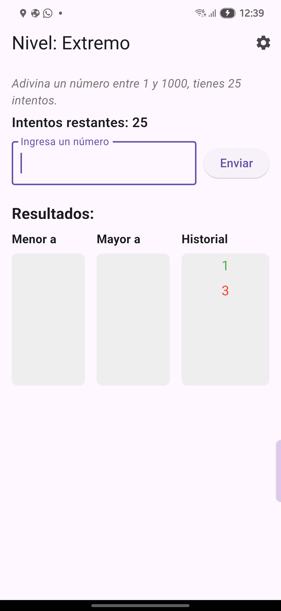
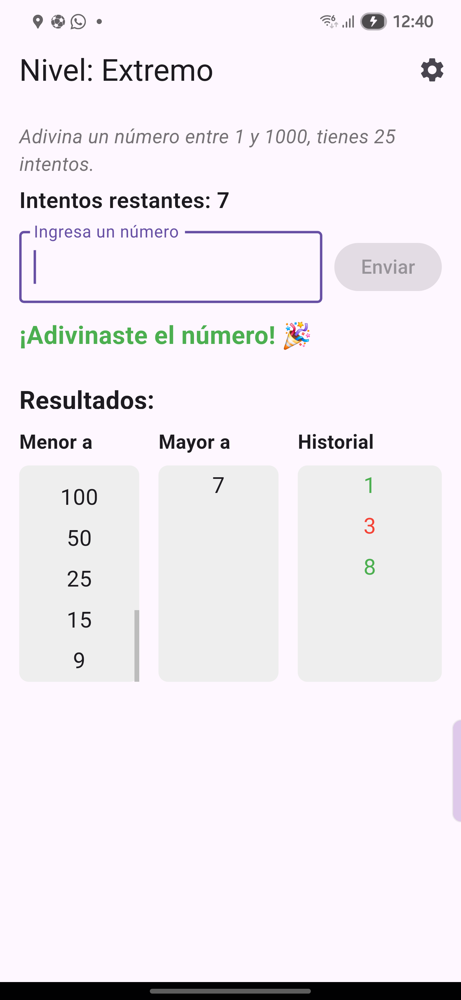

# numero_secreto_flutter

Un juego interactivo desarrollado en Flutter donde los usuarios deben adivinar un número secreto dentro de un rango según el nivel de dificultad seleccionado.  
Incluye validación de entradas, historial de intentos y gestión dinámica de niveles.

## Características

- 4 niveles de dificultad: Fácil, Medio, Avanzado y Extremo
- Validación de entrada (solo números dentro del rango)
- Historial de juegos acertados y fallidos con colores
- Columnas scrollables para intentos mayores, menores e historial
- Reinicio automático despues de 2 segundos al ganar o perder
- Opción para cambiar dificultad y limpiar historial

## Capturas de pantalla










## Instalación y ejecución

1. Clona el repositorio:

```bash
git clone https://github.com/Ezdras01/numero_secreto_flutter.git
cd numero_secreto_flutter

2. Instalar dependecias:
flutter pub get

3. Correr el proyecto:
futter run 

4. Generar APK
flutter build apk --release

## Autor

- Ezra Lehi Cortez — [@Ezdras01](https://github.com/Ezdras01)
